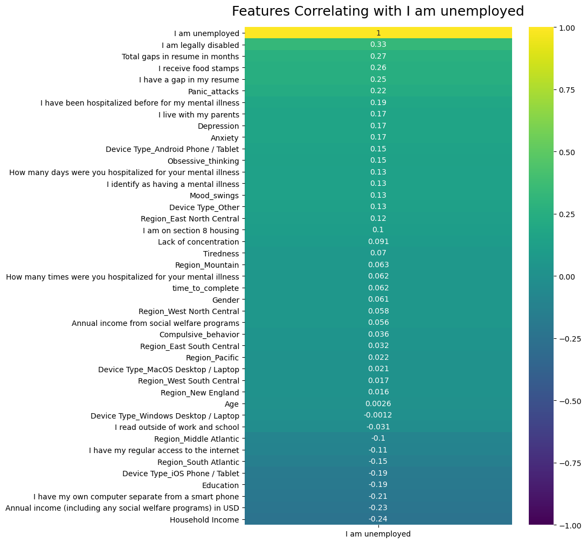
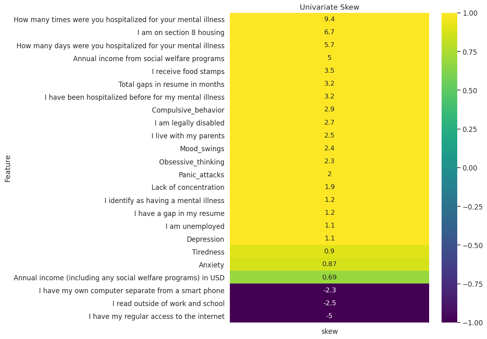
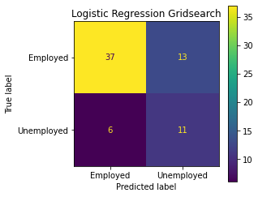
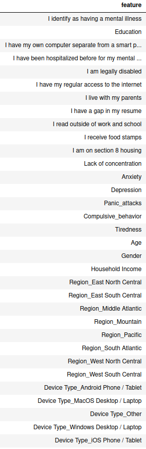
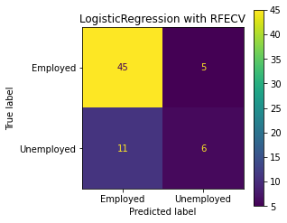
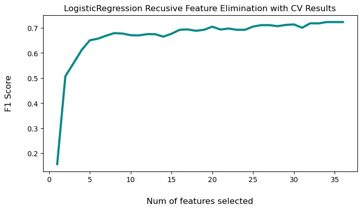
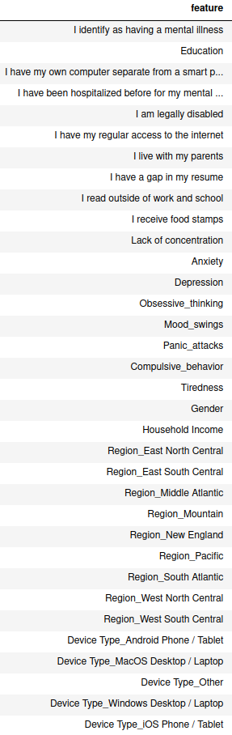
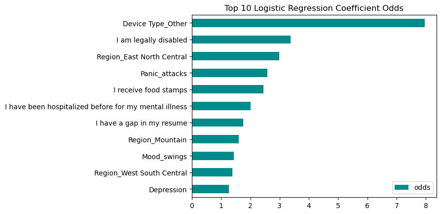
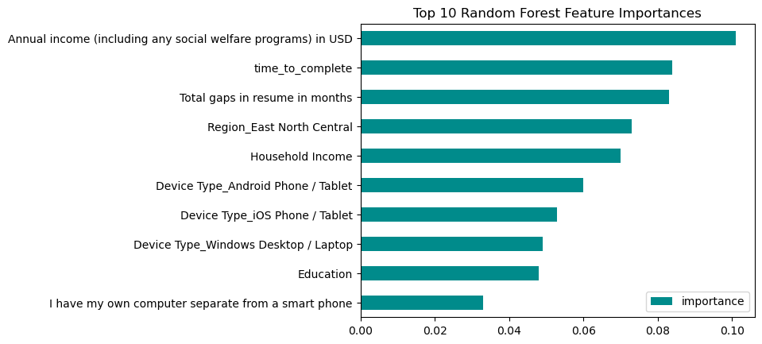

# Unemployment and Mental Health


## The Goal
The purpose of this repo is to show my thought process and workflow for tackling a new data science project. I have chosen a classification problem that has messy data and is balanced combination of numerical and categorical data to fully illustrate all steps in the data cleaning, preprocessing and modeling steps of a project. Thus, it is highly technical and not an example of a report to be delivered to non-data science teams or stakeholders.

I have written up the main points in this README document and the detailed steps can be seen in the <a href='https://github.com/camerongridley/UnemploymentMentalHealth/blob/main/notebooks/preprocessing%20and%20eda.ipynb'>EDA</a> and <a href='http://localhost:8888/notebooks/Projects/UnemploymentMentalHealth/notebooks/ModelingV3.ipynb'>Modeling</a> notebooks.


## The Problem

There have been many negative impacts of COVID-19 on our society. Two prominent effects are the increased rates of both mental health symptoms and unemployment. <a href="https://www.pewresearch.org/fact-tank/2020/05/07/a-third-of-americans-experienced-high-levels-of-psychological-distress-during-the-coronavirus-outbreak/">A Pew research study</a> found that 33% of Americans have experienced significantly high levels of psychological distress since the pandemic began. The DSM-5 states that typical prevalence for Major Depressive Disorder in the US is 7% and for Generalized Anxiety Disorder it is 2.9%. While the the Pew survey captured a broad array of symptoms and its participants were not diagnosed and thus the DSM statistics can't be a direct comparison, it is a helpful reference for how common anxiety and depression were in the American population before the pandemic.

According to a <a href="https://crsreports.congress.gov/product/pdf/R/R46554">report from the Congressional Research Service</a> , "The unemployment rate peaked at an unprecedented level, not seen since data collection started in 1948, in April 2020 (14.7%) before declining to a still-elevated level in November(6.7%)"

Furthermore, a <a href="https://news.gallup.com/poll/171044/depression-rates-higher-among-long-term-unemployed.aspx">Gallop poll</a> indicates that those who are unemployed for 6 months or more are over three times as likely to report depression compared to those with full-time jobs.

Exploring this relationship can be tricky as the effect is bi-directional in that mental health problems can contribute to losing one's job and unemployment can cause significant psychological distress.

Better understanding the relationship between these two areas would be helpful to helping people navigate these difficult times as well as mental health professionals identify patients who are most at risk for losing their job based on their symptomatology. There is a "chicken or the egg" problem regarding increased mental health symptoms and unemployment so no causal relationship can be ascertained from this analysis. I chose to focus on   help therapist shift focus to tools and strategies that help patients retain employment.

I wanted to see what insights I could find about this relationship and if I could build a model to predict which people experiencing mental health problem were most at risk for losing their jobs.

## The Data

The data is from a paid research study by Michael Corely, MBA, LSSBB, CPM and available on <a href="https://www.kaggle.com/michaelacorley/unemployment-and-mental-illness-survey">Kaggle</a>.

334 people were surveyed.

This data looks at a single point in time as it was captured over a period of two days, so determining the sequence of mental health issues and job loss was not possible.

The survey contained a mix of yes/no, open-ended and multiple choice questions:


### Data Cleaning and Pre-processing
The dataset needed quite a bit of cleaning and processing.

#### Drop Columns
- IP Address, Email Address, First Name, and Last Name, had no values, which I assume was for the purposes of confidentiality
- Responent ID was unnecessary since index could be used to track respondents
- CollectorID was the same for all rows so provided no useful information

```
data.drop(['Respondent ID', 'Collector ID', 'IP Address', 'Email Address', 'First Name', 'Last Name', 'Custom Data 1', 'I am currently employed at least part-time'], 
          axis=1, inplace=True)
```

#### Rename Columns
- 8 columns were ambiguously named with 'Unnamed' or 'Custom Data' labels. Inspection of the data indicated these were endorsements for mental health symptoms like "Anxiety", "Depression", and "Obsessive thinking". Therefore the columns were renamed accordingly.
```
data.rename(columns={
        'Unnamed: 28':'Anxiety',
        'Unnamed: 29':'Depression',
        'Unnamed: 30':'Obsessive_thinking',
        'Unnamed: 31':'Mood_swings',
        'Unnamed: 32':'Panic_attacks',
        'Unnamed: 33':'Compulsive_behavior',
        'Unnamed: 34':'Tiredness',
        data.columns[27] : 'Lack of concentration',
        data.columns[19] : 'Total gaps in resume in months', # this col name was causing problems so need to rename
    }, inplace=True)
```
#### Datatype Conversion
In order to  appropriately deal with the null values and perform analysis I had to convert all the columns to their appropriate datatypes as every column loaded as the 'object' dtype.

- All mental health columns were converted to boolean
- Many columns only contained values "Yes" and "No" and were also converted to boolean
- "Start Date" and "End Date" were converted to timestamp

```
symptom_cols = ['Anxiety', 'Depression', 'Obsessive_thinking', 'Mood_swings', 'Panic_attacks', 'Compulsive_behavior', 'Tiredness', 'Lack of concentration']
for col in symptom_cols:
    data[col].fillna(0, inplace=True)
    data[col] = data[col].apply(lambda x : 0 if x==0 else 1)

bool_cols = [col for col in data.columns if all(item in data[col].unique() for item in ['Yes', 'No'])]

data['Start Date'] = pd.to_datetime(data['Start Date'])
data['End Date'] = pd.to_datetime(data['End Date'])    
```

#### Handling Null Values and Imputation
Number of nulls per column


- All nulls in the mental health symptom columns and represented a denial of having that symptom so these nulls were filled with 0s to indicate the person did not experience the symptom.

- Region only contained 2 nulls so these rows were dropped.

- This left the 37 nulls from "How many days were you hospitalized for your mental illness?" to deal with. Given 37 rows is over 10% of the data I wanted to try to keep them. Luckily, column "I have been hospitalized before for my mental illness" had no null values. 
    - I compared the two, making the assumption that if the person said they had never been hospitalized then they number of days hospitalized could be set to 0. 36 of these rows of data met this condition and were imputed with 0. 
    - The single row that said they had been hospitalized but had null for the number of days was dropped.

#### Data Integrity Check
I was curious if anyone said they hasn't been hospitalized but reported days in the hospital. So I again compared these two features and if they reported days in the hospital and said they hadn't been hospitalized I updated 'I have been hospitalized before for my mental illness' to be True.

```
mask_no_hosp = data['I have been hospitalized before for my mental illness']==0
mask_hosp_days_gt_0 = data['How many days were you hospitalized for your mental illness']>0

idxs = data[mask_no_hosp & mask_hosp_days_gt_0]['I have been hospitalized before for my mental illness'].index
data['I have been hospitalized before for my mental illness'].iloc[idxs] = 1
```

#### Encoding Categorical Data
With all null handled and all features in the proper datatype, I could safely encode the remaining categorical features into numeric data using one-hot encoding.

```
cat_features = [col for col in data.columns if data[col].dtype=='object']
oh_encoder = OneHotEncoder(sparse=False)
oh_data = oh_encoder.fit_transform(data[cat_features])
```

#### Feature Engineering
I was curious if the time it took to complete the survey might add value so I created a feature called "time_to_complete" which was difference btween the start and end dates.

`encoded_df['time_to_complete'] = encoded_df['End Date'] - encoded_df['Start Date']`
## EDA
### Class Balance


We see there is a significant class imbalance, which about a 3:1 ratio of employed to unemployed.
So I will be sure to stratify the data when splitting it for training and testing the model. Resampling techniques for creating class balance may also be considered.

### Collinearity with Classes/Target


Nothing has a particularly high correlation so there is no clear need to eliminate a feature for it's collinearity with the target.

### Collinearity Between Features


### Skew of Univariate Distributions
Looking at the univariate skew tells us how close each feature's distribution is to normal. 
The close the skew is to 0, the more normal the distribution. This is interesting since many machine learning algorithms
assume a normal distribution of the features and therefore may be useful in feature selection.




## MODELING

### Cross Validation
In order to best simulate a real-world scenario in production where the model will be exposed to new, unseen data, I have used the most strict implementation of cross validation in which I split the data twice. The first split creates hold-out data on which the model with the best validation scores will tested with. The second split is for creating the training and validation data on which to run initial testing.

Also of note, stratified splits were used to keep the class balance represented withing the different splits.


### Random Seed
To ensure the various models are seeing the same data, the same random seed is being used for all data splits as well as for models that have random state parameters.

### Deciding on a Scoring Metric
Accuracy is the measure of the total number of predictions a model gets right. While a high accuracy score is attractive, it can be misleading, as it ignores how often a model gets a prediction wrong. This is especially relevant in unbalanced classes scenarios like this one. Here the greater number of "employed" data points can skew the accuracy result, so it is not the most useful metric of choice. 

A good way of deciding an alternative metric  that accounts for incorrect predictions is to ask, "What is the cost of an error?". 
When the cost of a false positive, i.e. predicting someone will become unemployed but they don't, is high, precision the preferred measure. 
On the other hand, when a false negative of predicting a person won't become unemployed but does, would be most costly, recall would be the metric of choice. This false negative scenario would likely be a case we would want to avoid the most. Therefore, recall is more important than precision or accuracy.

Finally, <b>F1</b> is a balance of recall and precision. As expected it is somewhere in between the two, but it is <b>most helpful in situations where there is a class imbalance and there are more actual negatives</b>. This is the case with our data where we have about a 3:1 ratio of negative to positive target responses. <b>So the F1 score may be the best score for our case.</b>

### Baseline Models
First let's see what performance we get from using all of the features with the default hyper-parameter values.

|Baseline Logistic Regression |Baseline Random Forest|
|--- | --- |
|||
|<b>Holdout Data Scores</b>||
|Accuracy: 0.76|Accuracy: 0.76|
|Precision: 0.55|Precision: 0.57|
|Recall: 0.35|Recall: 0.24|
|F1: 0.43|F1: 0.33|

#### Baseline Results
Initially, the 2 models perform relatively similarly with decent accuracy, fair precision and poor recall. Though the Logistic Regression slightly performs a bit better with an F1 of .43, which is still a poor score as we see that the Logistic Regression is unable to correctly predict unemployment two-thirds of the time.

### Hyperparameter Tuning with GridSearch
Hyperparameters are adjustments that can be made by the data scientist to tune how the model is fitting the data. GridSearch is a function that allows for iterating through all the values of hyperparameters selected and finding the set of hyperparameter values that result in the best performing model. GridSearchCV was used here, which adds in cross-folds validation to ensure more reliable results.

Attention was paid to a good cross validation process, GridSearchCV was performed on the training and validation set in order to find the best hyperparameters to produce the highest F1 score. Then I fit a new model, using the holdout data in order to accurately compare this approach to the baseline models as well as for subsequent models.

|GridSearch Logistic Regression |GridSearchCV Random Forest|
|--- | --- |
|||
|<b>Holdout Data Scores</b>||
|Accuracy: 0.72|Accuracy: 0.76|
|Precision: 0.46|Precision: 0.56|
|Recall: 0.65|Recall: 0.29|
|F1: 0.54|F1: 0.38|

#### GridSearchCV Results
We see an mild improvement for the Logistic Regression, especially in terms of recall and F1. So the ability to correctly classify someone being unemployed has improved it worse at correctly classifying someone as employment, as seen in the lower precision score. Though since we are more interested in correct unemployment classification, this decrease in precision is an acceptable tradeoff. There was barely any improvement in the Random Forest. 

## Feature Selection Refinement
### Random Forest Feature Importances
One of the benefits of the Random Forest model its interpretability as is it allows us to see which features were the most important.<br><br>

<br>

Income information, resume gaps, and time to complete were the highest by some margin. Interestingly there were no mental health symptom in the top 20 most important features. However, this is of limited value given the poor performance of the Random Forest model. Let's implement a more comprehensive feature selection technique to see if that will improve results.

### Recursive Feature Elimiation
This data set has a somewhat high number of features and many of them measure similar things. Reducing the number of features is likely to improve the model. We can use Recursive Feature Elimination with Cross Validation (RFECV) to do this. I performed RFECV using F1 for scoring. 

Again, attention was paid to a good cross validation process, RFECV was performed on the training and validation set in order to find the best set of features to produce the highest F1 score. Then I fit a new model, using the holdout data in order to accurately compare this approach to the previous models.

Of note is the overlap of the RFECV chosen features to the random forest feature importances identified earlier.

|RFECV Logistic Regression |RFECV Random Forest|
|--- | --- |
|||
|<b>RFECV Selected Features</b>||
|||
|||
|<b>Holdout Data Scores</b>||
|Accuracy: 0.76|Accuracy: 0.82|
|Precision: 0.55|Precision: 0.73|
|Recall: 0.35|Recall: 0.47|
|F1: 0.43|F1: 0.57|

### RFE Results
With the feature set reduced, we see a significant improvement in the Random Forest but a decline in the Logistic Regression performance. Still, both models' F1 score is mediocre. The fact that the classes are so imbalanced is likely having a big impact on how well the model can be trained.

## Resampling Techniques - SMOTE
One way of balancing the classes to improve representation of both classes is resampling. SMOTE is a oversampling technique that overcomes much of the overfitting problems associated with random oversampling.<br>

As we can see, SMOTE has properly balanced the classes.<br>


|RFECV/SMOTE Logistic Regression |RFECV/SMOTE Random Forest|
|--- | --- |
|||
|<b>RFECV Selected Features</b>||
|||
|||
|<b>Holdout Data Scores</b>||
|Accuracy: 0.71|Accuracy: 0.80|
|Precision: 0.69|Precision: 0.82|
|Recall: 0.76|Recall: 0.76|
|F1: 0.72|F1: 0.79|


<!-- Replaced with bar charts
#### Top 10 Logistic Regression Feature Coefficients
|Feature Name|Coefficient|
|--- |--- |
|Device Type_Other                                                |7.97|
|I am legally disabled                                            |3.38|
|Region_East North Central                                        |2.98|
|Panic_attacks                                                    |2.59|
|I receive food stamps                                            |2.45|
|I have been hospitalized before for my mental illness 	          |2.00|
|I have a gap in my resume 	                                      |1.75|
|Region_Mountain 	                                              |1.60|
|Mood_swings 	                                                  |1.44|
|Depression 	                                                  |1.26|

<br>

#### Top 10 Random Forest Feature Importances
|Feature Name|Importance|
|--- |--- |
|Annual income (including any social welfare programs) in USD    |0.096|
|time_to_complete                                                |0.083|
|Total gaps in resume in months                                  |0.081|
|Household Income                                                |0.074|
|Education                                                       |0.068|
|Region_East North Central                                       |0.063|
|Annual income from social welfare programs                      |0.044|
|Device Type_iOS Phone / Tablet                                  |0.044|
|Device Type_Windows Desktop / Laptop                            |0.040|
|I have my own computer separate from a smart phone              |0.037|

When compared to the top features of the previous random forests, many of the top features have stayed the same, especially those related to wealth and previous unemployment (i.e. gaps in resume). Interestingly, 'Age' and 'I am legally disabled' fell off the list. Given that the previous models were poor performers. "Time to complete" also continues to be an important feature. 
-->
### SMOTE Results
As hoped, using SMOTE helps significantly and we get the best performance thus far for both models. Looking at our target metric of F1 score, Logistic Regression and Random Forest perform very similarly (.72 vs .79). At this point, picking a model comes down to how useful, and therefore interpretable, it is. Both algorithms have ways of looking at what factors are influencing performance. Logistic Regression has feature coefficients which can be converted to odds and Random forest has feature importances which is based on Gini impurity/information gain (entropy).

Odds are more understandable than entropy so Logistic Regression tends to be more useful for interpretation.


|

Both models find a history of unemployment and the East_North_Central region to be key in predicting future unemployment. Interesting, they diverge a bit from there. Logistic Regression identifies specific mental health symptoms of Panic Attacks, Mood Swings and Depression as well as Disability as strong influences. Random Forest indicates that income and time_to_complete are some of the most important features.

Of note is that Device Type_Other is the top Logistic Regression feature and very few respondents selected this option. I have no additional information about what this designation means but given the small number of people who endorsed it, caution should be used in the validity of it's weight.

While SMOTE mitigates much of the overfitting seen with some other oversampling techniques, it still a risk. However, the final scores using the holdout data indicate that overfitting is not a significant problem here. 

### Hyperparameter Tuning
Gridsearch with Cross Validation was performed on the Random Forest model in order to find the best hyperparameters, however, it did not lead to an improved score.

## Summary
With several data science tools, I was able to improve F1 scores for a Logistic Regression model from .43 to .72 and a Random Forest model from .33 to .79. While the Random Forest slightly outperforms the Logistic Regression, the Logistic Regression's interpretability may make it the preferred model for clinical use in predicting unemployment of patients.


