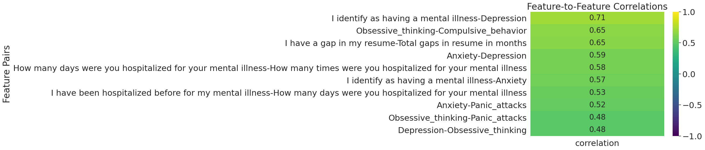
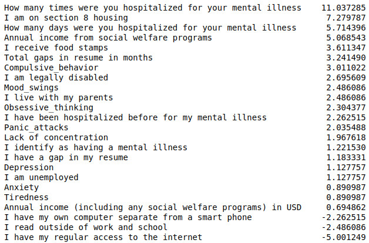
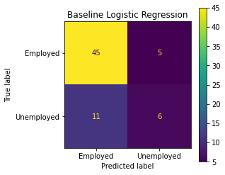
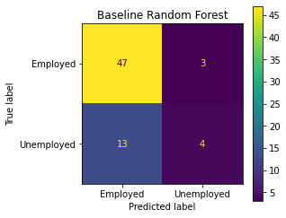
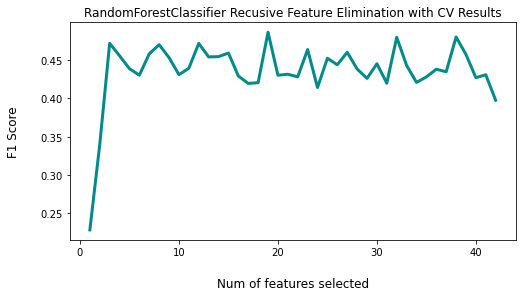
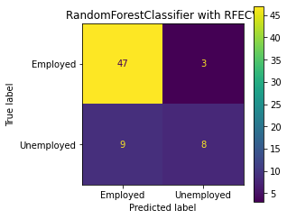
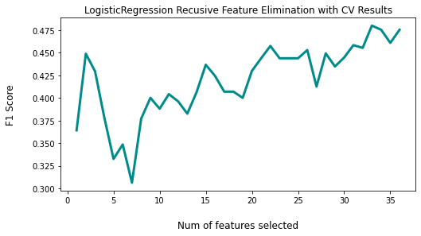

# Unemployment and Mental Health


## The Problem

There have been many negative impacts of COVID-19 on our society. Two prominent effects are the increased rates of both mental health symptoms and unemployment. <a href="https://www.pewresearch.org/fact-tank/2020/05/07/a-third-of-americans-experienced-high-levels-of-psychological-distress-during-the-coronavirus-outbreak/">A Pew research study</a> found that 33% of Americans have experienced significantly high levels of psychological distress since the pandemic began. The DSM-5 states that typical prevelence for Major Depressive Disorder in the US is 7% and for Generalized Anxiety Disorder it is 2.9%. While the the Pew survey captured a broad array of symptoms and its partcipants were not diagnosed and thus the DSM statistics can't be a direct comparison, it is a helpful reference for how common anxiety and depression were in the American population before the pandemic.

According to a <a href="https://crsreports.congress.gov/product/pdf/R/R46554">report from the Congression Research Service</a> , "The unemployment rate peaked at an unprecedented level, not seen since data collection started in 1948, in April 2020 (14.7%) before declining to a still-elevated level in November(6.7%)"

Furthermore, a <a href="https://news.gallup.com/poll/171044/depression-rates-higher-among-long-term-unemployed.aspx">Gallop poll</a> indicates that those who are unemployed for 6 months or more are over three times as likely to report depression compared to those with full-time jobs.

Exploring this relationship can be tricky as the effect is bi-directional in that mental health problems can contribute to losing one's job and unemployment can cause significant psychological distress.

Better undersanding the relationship between these two areas would be helpful to helping people navigate these dfficudult times as well as mental health professionals identify patients who are most at risk for losing thier job based on thier symptomotology. There is a "chicken or the egg" problem regarding increased mental health symptoms and unemployment so no causal relationship can be ascertained from this analysis. I chose to focus on   help therapist shift focus to tools and strategies that help patients retain emplloyment.

I wanted to see what insights I could find about this relationship and if I could build a model to predict which people experiecing mental health problem were most at risk for losing thier jobs.

## The Data

The data is from a paid research study by Michael Corely, MBA, LSSBB, CPM and available on <a href="https://www.kaggle.com/michaelacorley/unemployment-and-mental-illness-survey">Kaggle</a>.

334 people were surveyed.

This data looks at a single point in time as it was captured over a period of two days, so determining the sequence of mental health issues and job loss was not possible.

The survey contained a mix of yes/no, open-ended and multiple choice questions:


<!--  - Respondent ID
- Collector ID
- IP Address
- Email Address
- First Name
- Last Name
- I identify as having a mental illness
- Education   
- I have my own computer separate from a smart phone   
- I have been hospitalized before for my mental illness   
- How many days were you hospitalized for your mental illness   
- I am currently employed at least part-time   
- I am legally disabled   
- I have my regular access to the internet   
- I live with my parents   
- I have a gap in my resume   
- Total length of any gaps in my resume in&nbsp;months.   
- Annual income (including any social welfare programs) in USD   
- I am unemployed   
- I read outside of work and school   
- Annual income from social welfare programs   
- I receive food stamps   
- I am on section 8 housing   
- How many times were you hospitalized for your mental illness   
- Age   
- Gender   
- Household Income   
- Region   
- Device Type
- I have one of the following&nbsp;issues in addition to my illness:
    -    Lack of concentration
    -    Anxiety
    -    Depression
    -    Obsessive thinking
    -    Mood swings
    -    Panic attacks
    -    Compulsive behavior
    -    Tiredness
-->


### Data Cleaning and Pre-processing
The dataset needed quite a bit of cleaning and processing.

#### Drop Columns
- IP Address, Email Address, First Name, and Last Name, had no values, which I assume was for the purposes of confidentiality
- Responent ID was unecessary since index could be used to track repondents
- CollectorID was the same for all rows so provided no useful information

```
data.drop(['Respondent ID', 'Collector ID', 'IP Address', 'Email Address', 'First Name', 'Last Name', 'Custom Data 1', 'I am currently employed at least part-time'], 
          axis=1, inplace=True)
```

#### Rename Columns
- 8 columns were ambiguously named with 'Unnamed' or 'Custom Data' labels. Inspection of the data indicated these were endorsements for mental health symptoms like "Anxiety", "Depression", and "Obsessive thinking". Therefore the columns were renamed accordingly.
```
data.rename(columns={
        'Unnamed: 28':'Anxiety',
        'Unnamed: 29':'Depression',
        'Unnamed: 30':'Obsessive_thinking',
        'Unnamed: 31':'Mood_swings',
        'Unnamed: 32':'Panic_attacks',
        'Unnamed: 33':'Compulsive_behavior',
        'Unnamed: 34':'Tiredness',
        data.columns[27] : 'Lack of concentration',
        data.columns[19] : 'Total gaps in resume in months', # this col name was causing problems so need to rename
    }, inplace=True)
```
#### Datatype Conversion
In order to  appropriately deal with the null values and perform analysis I had to convert all the columns to their appropriate datatypes as every column loaded as the 'object' dtype.

- All mental health columns were converted to boolean
- Many columns only contained values "Yes" and "No" and were also converted to boolean
- "Start Date" and "End Date" were converted to timestamp

```
symptom_cols = ['Anxiety', 'Depression', 'Obsessive_thinking', 'Mood_swings', 'Panic_attacks', 'Compulsive_behavior', 'Tiredness', 'Lack of concentration']
for col in symptom_cols:
    data[col].fillna(0, inplace=True)
    data[col] = data[col].apply(lambda x : 0 if x==0 else 1)

bool_cols = [col for col in data.columns if all(item in data[col].unique() for item in ['Yes', 'No'])]

data['Start Date'] = pd.to_datetime(data['Start Date'])
data['End Date'] = pd.to_datetime(data['End Date'])    
```

#### Null Values
Number of nulls per column


- All nulls in the mental health symptom columns and represented a denial of having that symptom so these nulls were filled with 0s to indicate the person did not experience the symptom.

- Region only contained 2 nulls so these rows were dropped.

- This left the 37 nulls from "How many days were you hospitalized for your mental illness?" to deal with. Given 37 rows is over 10% of the data I wanted to try to keep them. Luckily, column "I have been hospitalized before for my mental illness" had no null values. 
    - I compared the two, making the assumption that if the person said they had never been hospitalized then they number of days hospitalized could be set to 0. 36 of these rows of data met this condition and were imputed with 0. 
    - The single row that said they had been hositalized but had null for the number of days was dropped.

#### Data Integrity Check
I was curious if anyone said they hasn't been hospitalized but reported days in the hospital. So I again compared these two features and if they reported days in the hospital and said they hadn't been hospitalized I updated 'I have been hospitalized before for my mental illness' to be True.

```
mask_no_hosp = data['I have been hospitalized before for my mental illness']==0
mask_hosp_days_gt_0 = data['How many days were you hospitalized for your mental illness']>0

idxs = data[mask_no_hosp & mask_hosp_days_gt_0]['I have been hospitalized before for my mental illness'].index
data['I have been hospitalized before for my mental illness'].iloc[idxs] = 1
```

#### Encoding Categorical Data
With all null handled and all features in the proper datatype, I could safely encode the remaining categorical features into numeric data using one-hot encoding.

```
cat_features = [col for col in data.columns if data[col].dtype=='object']
oh_encoder = OneHotEncoder(sparse=False)
oh_data = oh_encoder.fit_transform(data[cat_features])
```

#### Feature Engineering
I was curious if the time it took to complete the survey might add value so I created a feature called "time_to_complete" which was difference btween the start and end dates.

`encoded_df['time_to_complete'] = encoded_df['End Date'] - encoded_df['Start Date']`
## EDA
### Class Balance


We see there is a significant class imbanace, which about a 3:1 ratio of employed to unemployed.
So I will be sure to stratify the data when splitting it for training and testing the model. Resampling techniques for creating class balance may also be considered.

### Collinearity with Classes/Target


Nothing has a particularly high correlation so there is no clear need to eliminate a feature for it's collinearity with the target.

### Collinearity Between Features


### Skew of Univariate Distributions
Looking at the univatiate skew tells us how close each feature's distribution is to normal. 
The close the skew is to 0, the more normal the distribution. This is interesting since many manchine learning algorithms
assume a normal distribution of the features and therefore may be useful in feature selection.




## MODELING
### Baseline Models
First let's see what performance we get from using all of the features with the default hyper-parameter values:
#### Baseline Logistic Regression
<br>
Accuracy: 0.75<br>
Precision: 0.5<br>
Recall: 0.29<br>
F1: 0.37<br>

#### Baseline Random Forest<br>
<br>
Accuracy: 0.76<br>
Precision: 0.57<br>
Recall: 0.24<br>
F1: 0.33<br>

#### Initial Results
Initially, the 2 models perform similarly with decent accuracy, fair precision and poor recall. The poor recall has a strong effect on making the F1 score poor as well.

##### What is the best metric for this case? 
While the high accuracy score is attractive, it can be misleading especially in unbalanced classes scenarios like this one. Here the greater numer of "employed" datapoints can skew the accuracy result, so it is not the most useful metric of choice. 

The cost of a false positive, i.e. predicting someone will become unemployed but they don't, is not likely a great concern. Precision is a reflection of this, so will not be the ideal metric in this case.

On the other hand, a false negative of predicing a person won't become unemployed but does, would mostly likely be a case we would want to avoid the most. Therefore, recall is more important than precision or accuracy.

<b>F1</b> is a balance of recall and precision. As expected it is somewhere in between the two, but it is <b>most helpful in situations where there is a class imbalance and there are more actual negatives</b>. This is the case with our data where we have about a 3:1 ratio of negative to positive target responses. <b>So the F1 score may be the best score for our case.</b>

## Feature Selection Refinement
### Random Forest Feature Importances
One of the benefits of the Random Forest model is it allows us to see which features were the most important.<br><br>

<br>

Resume gaps and income, income information and time to complete were the highest by some margin. Interestingly only 1 mental health symptom, anxiety, made the top 20 most important features.

### Recursive Feature Elimiation
This data set has a somewhat high number of features and many of them measure similar things. Reducing the number of features is likely to improve the model. We can use Recursive Feature Elimiation with Cross Validation (RFECV) to do this. I performed RFECV using F1 for scoring. 
#### Random Forest
Results indicate the best number of features to use is 5.<br>

<br>
Here we see which were the best features of the group. The engineered feature 'time to complete' appears to be quite influential.

Also of note is the similarity of the RFECV chosen features to the random forest feature importances idetified earlier. 


When a new Random Forest was fit with this subset of features using the same data split as with previous models, we see a substatial increase in F1 score from 0.33 to 0.55

Accuracy: 0.78<br>
Precision: 0.56<br>
Recall: 0.53<br>
F1: 0.55<br>



Interestingly, when I ran RFECV with recall scoring and fit a Random Forest with the resulting feature subset I got an even higher F1 score of 0.67. However, the random seed chosen for the train-test-split may just happen to lead to a partciularly high F1 score and not be representative of performance on unseen data. While the RFECV with F1 scoring might not show as much improvement with this data split, it is likely a more reliable model for predicting new data since it is a cross-validated score and not a score generated from a single split.

#### Logistic Regression
Results indicate the best number of features to use is 21.<br>

<br>
Here we see which were the best features of the group. Again, disability, gaps in resume, and income

Also of note is the similarity of the RFECV chosen features to the random forest feature importances idetified earlier. 


When a new Random Forest was fit with this subset of features using the same data split as with previous models, we see a substatial increase in F1 score from 0.33 to 0.55

Accuracy: 0.75<br>
Precision: 0.5<br>
Recall: 0.24<br>
F1: 0.32<br>


### Hyperparameter Tuning
Gridsearch with Criss Validation was performed on the Random Forest model in order to find the best hyperparameters, however, it did not lead to an imporoved score.

## Real World Implications

## Additional Steps To Consider
### PCA
### Class Balancing techniques
Oversampling is likely the best candidate since we have relatively few datapoints.

